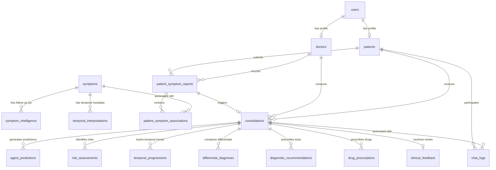

# MedAgentix AI — Relational Database Schema Design

This document details the recommended database architecture for **MedAgentix AI**. The design bridges user management (Patients, Doctors, Admins), multi-agent clinical diagnostic pipelines, machine learning predictions, RAG knowledge querying, and structured feedback logging.

---

## 1. Architectural Overview & Domain Separation

To ensure clean encapsulation, high performance, and smooth integration with the machine learning data pipelines, the database is divided into **four logical domains**:

```
                  +-----------------------------------+
                  |   User & Auth Domain              |
                  |   - Users, Patients, Doctors      |
                  +-----------------+-----------------+
                                    |
                                    v
                  +-----------------+-----------------+
                  |   Clinical & Symptom Domain       |  <-- THE BACKBONE
                  |   - Symptoms, Symptom Reports,    |
                  |     Symptom Intelligence          |
                  +-----------------+-----------------+
                                    |
                                    v
                  +-----------------+-----------------+
                  |   Multi-Agent & ML Domain         |
                  |   - Consultations, Predictions,   |
                  |     Temporal, Risks, Recs         |
                  +-----------------+-----------------+
                                    |
                                    v
                  +-----------------+-----------------+
                  |   Feedback & Chat Audit Domain    |
                  |   - Feedback, Chat Logs           |
                  +-----------------------------------+
```

1. **User & Authentication Domain**: Manages accounts, credentials, and medical staff/patient profiles.
2. **Clinical & Symptom Domain (The Backbone)**: Models how symptoms are defined, queried, and reported. This maps directly to the feature inputs expected by the Random Forest, XGBoost, and LightGBM models.
3. **Multi-Agent & ML Domain**: Stores the state of multi-agent execution, including the primary ensemble prediction, explainable AI explanations (SHAP/LIME), temporal patterns, and drug/diagnostic recommendations.
4. **Feedback & Chat Audit Domain**: Closes the loop with expert physician verification, enabling reinforcement learning and model retraining, along with capturing session-based chat logs.

---

## 2. Entity-Relationship (ER) Diagram



---

## 3. The Symptoms Database Structure: The Pipeline Backbone

> [!IMPORTANT]
> **Why Symptoms form the System Backbone**:  
> In the MedAgentix AI machine learning pipeline, tabular symptom columns are encoded as numeric features (e.g., binary `1`/`0` or ordinal scores) to feed the Voting Ensemble model (`disease_model.pkl`).  
> 
> By decoupling symptoms into a relational schema, the pipeline can dynamically extract patient inputs, map them to the corresponding pre-processing functions in `data_pipeline/preprocess.py`, and format the input vector for the predictive models without hardcoding feature lists in code.

### A. Table: `symptoms` (Symptom Registry)
A central dictionary of all symptoms supported by the system.
* **Purpose**: Maps standard clinical names to pipeline-encoded columns.

| Column Name | Data Type | Constraints | Description |
|:---|:---|:---|:---|
| `id` | SERIAL / INT | PRIMARY KEY | Unique identifier. |
| `name` | VARCHAR(100) | UNIQUE, NOT NULL | Standard name, e.g., `"Difficulty Breathing"`, `"Fever"`. |
| `slug` | VARCHAR(100) | UNIQUE, NOT NULL | Machine-readable column name matching datasets, e.g., `"difficulty_breathing"`, `"fever"`. |
| `clinical_category` | VARCHAR(50) | NULL | e.g., `"Respiratory"`, `"General"`, `"Neurological"`. |
| `is_emergency_flag` | BOOLEAN | DEFAULT FALSE | If `True`, presence triggers immediate Emergency Agent alert. |
| `priority_level` | VARCHAR(10) | CHECK (IN ('Low', 'Medium', 'High')) | Used to rank symptom gathering in diagnostic sessions. |
| `created_at` | TIMESTAMP | DEFAULT CURRENT_TIMESTAMP | Registry creation date. |

### B. Table: `symptom_intelligence`
Directly matches the `symptom_intelligence` dataset processing in `data_pipeline/config.py`.
* **Purpose**: Powers the **Symptom Agent** in generating dynamic, contextual follow-up questions during dynamic user chats.

| Column Name | Data Type | Constraints | Description |
|:---|:---|:---|:---|
| `id` | SERIAL / INT | PRIMARY KEY | Unique identifier. |
| `symptom_id` | INT | FOREIGN KEY (symptoms.id) ON DELETE CASCADE | The primary symptom triggering this follow-up. |
| `follow_up_question` | TEXT | NOT NULL | Dynamic question, e.g., `"Is the fever higher in the evening?"`. |
| `question_type` | VARCHAR(30) | NOT NULL | e.g., `"Boolean"`, `"Ordinal"`, `"Multi-choice"`. |
| `expected_values` | VARCHAR(255) | NULL | Permitted inputs, e.g., `"Yes, No"`, `"Mild, Moderate, Severe"`. |
| `priority` | INT | DEFAULT 1 | Priority ordering for displaying questions (1=Low, 2=Medium, 3=High). |
| `clinical_category` | VARCHAR(50) | NULL | Categorization for analytical groupings. |

---

## 4. Main Database Tables & Schema

### Domain A: User & Identity

#### A1. Table: `users`
* **Purpose**: Stores authentication credentials, account roles, and basic lifecycle dates.

| Column Name | Data Type | Constraints | Description |
|:---|:---|:---|:---|
| `id` | UUID / SERIAL | PRIMARY KEY | Unique account identifier. |
| `email` | VARCHAR(150) | UNIQUE, NOT NULL | Primary login email address. |
| `password_hash` | VARCHAR(255) | NOT NULL | Securely hashed password. |
| `role` | VARCHAR(20) | CHECK (IN ('Patient', 'Doctor', 'Admin')) | Access level. |
| `is_active` | BOOLEAN | DEFAULT TRUE | Account state. |
| `created_at` | TIMESTAMP | DEFAULT CURRENT_TIMESTAMP | Account creation timestamp. |
| `updated_at` | TIMESTAMP | DEFAULT CURRENT_TIMESTAMP | Last profile modification. |

#### A2. Table: `doctors`
* **Purpose**: Contains professional details for verified healthcare providers using the platform.

| Column Name | Data Type | Constraints | Description |
|:---|:---|:---|:---|
| `id` | SERIAL / INT | PRIMARY KEY | Unique doctor identifier. |
| `user_id` | UUID / INT | FOREIGN KEY (users.id) UNIQUE | Reference to auth user record. |
| `first_name` | VARCHAR(100) | NOT NULL | First name. |
| `last_name` | VARCHAR(100) | NOT NULL | Last name. |
| `specialization` | VARCHAR(100) | NOT NULL | Specialization, e.g., `"Cardiology"`, `"Pediatrics"`. |
| `license_number` | VARCHAR(50) | UNIQUE, NOT NULL | Clinical registration license. |
| `hospital_name` | VARCHAR(150) | NULL | Associated hospital / clinic. |
| `phone_number` | VARCHAR(20) | NULL | Professional contact number. |
| `availability_status`| VARCHAR(20) | DEFAULT 'Available' | Current queue status. |

#### A3. Table: `patients`
* **Purpose**: Captures demographic metadata and baseline medical information required by predictive models.

| Column Name | Data Type | Constraints | Description |
|:---|:---|:---|:---|
| `id` | SERIAL / INT | PRIMARY KEY | Unique patient identifier. |
| `user_id` | UUID / INT | FOREIGN KEY (users.id) UNIQUE | Reference to auth user record. |
| `first_name` | VARCHAR(100) | NOT NULL | First name. |
| `last_name` | VARCHAR(100) | NOT NULL | Last name. |
| `date_of_birth` | DATE | NOT NULL | Date of birth (used to compute dynamic age features). |
| `gender` | VARCHAR(10) | CHECK (IN ('Male', 'Female', 'Other')) | Biological sex. |
| `blood_group` | VARCHAR(5) | NULL | ABO blood type. |
| `emergency_contact_name` | VARCHAR(150) | NULL | Primary emergency contact name. |
| `emergency_contact_phone`| VARCHAR(20) | NULL | Primary emergency contact number. |

---

### Domain B: Clinical Submissions

#### B1. Table: `patient_symptom_reports`
* **Purpose**: Records a clinical snapshot when a patient describes symptoms or when an OCR report is parsed.
* **Alignment**: Aligns with columns in the `Core Clinical` dataset (`fever`, `cough`, `fatigue`, `difficulty_breathing`, `blood_pressure`, `cholesterol`).

| Column Name | Data Type | Constraints | Description |
|:---|:---|:---|:---|
| `id` | SERIAL / INT | PRIMARY KEY | Unique report identifier. |
| `patient_id` | INT | FOREIGN KEY (patients.id) | Submitting patient. |
| `recorded_by_doctor_id` | INT | FOREIGN KEY (doctors.id) NULL | Doctor recording the report (if applicable). |
| `report_source` | VARCHAR(20) | CHECK (IN ('Chatbot', 'OCR_Report', 'Manual')) | Mode of generation. |
| `fever` | BOOLEAN / INT | DEFAULT 0 | 0=No, 1=Yes. Core model feature. |
| `cough` | BOOLEAN / INT | DEFAULT 0 | 0=No, 1=Yes. Core model feature. |
| `fatigue` | BOOLEAN / INT | DEFAULT 0 | 0=No, 1=Yes. Core model feature. |
| `difficulty_breathing` | BOOLEAN / INT | DEFAULT 0 | 0=No, 1=Yes. Core model feature. |
| `blood_pressure` | INT | NULL | Ordinal mapping (1=Low, 2=Normal, 3=Elevated, 4=High). |
| `cholesterol` | INT | NULL | Ordinal mapping or exact numeric (mg/dL). |
| `overall_severity` | INT | NULL | Ordinal mapping (1=Mild, 2=Moderate, 3=Severe, 4=Critical). |
| `duration_category` | INT | NULL | Ordinal mapping (1=1-3 Days, 2=4-7 Days, 3=1-2 Weeks, 4=Chronic). |
| `systolic_bp` | INT | NULL | Numeric reading from vitals/OCR. |
| `diastolic_bp` | INT | NULL | Numeric reading from vitals/OCR. |
| `heart_rate_bpm` | INT | NULL | Numeric reading. |
| `body_temperature_f` | NUMERIC(5,2) | NULL | Numeric reading (Fahrenheit). |
| `oxygen_level_pct` | INT | NULL | Oxygen saturation percentage. |
| `notes` | TEXT | NULL | Additional text descriptions for RAG search. |
| `created_at` | TIMESTAMP | DEFAULT CURRENT_TIMESTAMP | Submission timestamp. |

#### B2. Table: `patient_symptom_associations`
* **Purpose**: A junction table that maps specific symptoms to clinical reports, preserving many-to-many dynamics. This avoids polluting `patient_symptom_reports` with hundreds of columns when expanding symptoms.

| Column Name | Data Type | Constraints | Description |
|:---|:---|:---|:---|
| `report_id` | INT | FOREIGN KEY (patient_symptom_reports.id) ON DELETE CASCADE | Reference to parent symptom report. |
| `symptom_id` | INT | FOREIGN KEY (symptoms.id) | Reference to standard symptom. |
| `severity` | INT | CHECK (severity BETWEEN 1 AND 4) | Specific severity (1=Mild, ..., 4=Critical). |
| `duration_days` | INT | NULL | Exact days the patient experienced this specific symptom. |
| PRIMARY KEY | `(report_id, symptom_id)` | Composite key | Ensures no duplicate symptom rows per report. |

---

### Domain C: Diagnostic Consultations & Agent Inference

#### C1. Table: `consultations`
* **Purpose**: Tracks an active diagnostic session.
* **Alignment**: Unifies the symptom report, the doctor handling the case, and the final clinical outcome.

| Column Name | Data Type | Constraints | Description |
|:---|:---|:---|:---|
| `id` | SERIAL / INT | PRIMARY KEY | Unique session identifier. |
| `patient_id` | INT | FOREIGN KEY (patients.id) NOT NULL | Patient. |
| `doctor_id` | INT | FOREIGN KEY (doctors.id) NULL | Assigned doctor overseeing the session. |
| `symptom_report_id` | INT | FOREIGN KEY (patient_symptom_reports.id) | Linked symptom snapshot. |
| `primary_diagnosis` | VARCHAR(100) | NULL | Final matched disease (e.g., from 40 model classes). |
| `confidence_score` | NUMERIC(5,4) | NULL | Voting Ensemble probability (0.0000 to 1.0000). |
| `status` | VARCHAR(25) | DEFAULT 'Pending' | CHECK (IN ('Pending', 'Reviewing', 'Completed', 'Escalated')) |
| `created_at` | TIMESTAMP | DEFAULT CURRENT_TIMESTAMP | Consultation start time. |
| `updated_at` | TIMESTAMP | DEFAULT CURRENT_TIMESTAMP | Consultation update time. |

#### C2. Table: `agent_predictions`
* **Purpose**: Logs predictions from each individual ML model and the main Voting Ensemble, alongside explainable AI data.
* **Alignment**: Maps to Random Forest, XGBoost, and LightGBM models trained in `models/train_model.py`.

| Column Name | Data Type | Constraints | Description |
|:---|:---|:---|:---|
| `id` | SERIAL / INT | PRIMARY KEY | Unique identifier. |
| `consultation_id` | INT | FOREIGN KEY (consultations.id) ON DELETE CASCADE | Associated diagnostic session. |
| `model_name` | VARCHAR(50) | NOT NULL | `"Voting_Ensemble"`, `"XGBoost"`, `"Random_Forest"`, `"LightGBM"`. |
| `disease` | VARCHAR(100) | NOT NULL | Name of the predicted disease. |
| `rank` | INT | CHECK (rank BETWEEN 1 AND 3) | Top-1, Top-2, or Top-3 recommendation. |
| `confidence_score` | NUMERIC(5,4) | NOT NULL | Confidence score. |
| `xai_explanations` | JSONB / TEXT | NULL | SHAP/LIME explanation data (feature contributions). |

#### C3. Table: `temporal_progressions`
* **Purpose**: Tracks temporal patterns and symptom progression.
* **Alignment**: Aligned with the **Temporal Agent** and the `Temporal` dataset.

| Column Name | Data Type | Constraints | Description |
|:---|:---|:---|:---|
| `id` | SERIAL / INT | PRIMARY KEY | Unique identifier. |
| `consultation_id` | INT | FOREIGN KEY (consultations.id) ON DELETE CASCADE | Linked consultation. |
| `symptom` | VARCHAR(100) | NOT NULL | e.g., `"Cough"`. |
| `duration` | VARCHAR(50) | NOT NULL | e.g., `"1-3 Days"`, `"Chronic"`. |
| `interpretation` | TEXT | NOT NULL | Temporal Agent advice, e.g., `"Indicates acute onset"`. |
| `risk_level` | INT | NULL | Ordinal mapping (1=Low, 2=Medium, 3=High, 4=Critical). |
| `clinical_category` | VARCHAR(50) | NULL | Clinical grouping. |

#### C4. Table: `risk_assessments`
* **Purpose**: Logs individual risk factor details assessed for the patient during diagnostic analysis.
* **Alignment**: Aligned with the **Risk Agent** and the `Risk Factor` dataset.

| Column Name | Data Type | Constraints | Description |
|:---|:---|:---|:---|
| `id` | SERIAL / INT | PRIMARY KEY | Unique identifier. |
| `consultation_id` | INT | FOREIGN KEY (consultations.id) ON DELETE CASCADE | Linked consultation. |
| `risk_factor` | VARCHAR(100) | NOT NULL | Risk identifier, e.g., `"Smoking"`, `"Family History"`. |
| `associated_condition`| VARCHAR(100) | NOT NULL | Linked condition category, e.g., `"Respiratory Disorder"`. |
| `weight_score` | INT | NOT NULL | Numeric priority (1=Low, 2=Medium, 3=High, 4=Critical). |
| `is_modifiable` | BOOLEAN | DEFAULT TRUE | If the factor can be reduced by patient lifestyle. |
| `risk_type` | VARCHAR(50) | NULL | e.g., `"Lifestyle"`, `"Environmental"`, `"Genetic"`. |
| `recommended_action` | TEXT | NULL | Modifiability advisory text. |

#### C5. Table: `differential_diagnoses`
* **Purpose**: Captures differential diagnoses considered before finalizing.
* **Alignment**: Aligned with the **Differential Agent** and `Differential Diagnosis` dataset.

| Column Name | Data Type | Constraints | Description |
|:---|:---|:---|:---|
| `id` | SERIAL / INT | PRIMARY KEY | Unique identifier. |
| `consultation_id` | INT | FOREIGN KEY (consultations.id) ON DELETE CASCADE | Linked consultation. |
| `disease` | VARCHAR(100) | NOT NULL | e.g., `"COPD"`. |
| `differentiating_factor`| TEXT | NULL | Defining difference, e.g., `"Absence of high fever"`. |
| `symptom_set` | TEXT | NULL | Array/String of active symptoms. |
| `possible_diseases` | TEXT | NULL | Comorbidities list. |

#### C6. Table: `diagnostic_recommendations`
* **Purpose**: Recommended screening steps and lab tests.
* **Alignment**: Aligned with the **Recommendation Agent** and `Test Diagnostic` dataset.

| Column Name | Data Type | Constraints | Description |
|:---|:---|:---|:---|
| `id` | SERIAL / INT | PRIMARY KEY | Unique identifier. |
| `consultation_id` | INT | FOREIGN KEY (consultations.id) ON DELETE CASCADE | Linked consultation. |
| `recommended_test` | VARCHAR(150) | NOT NULL | e.g., `"Chest X-Ray"`, `"CBC Blood Test"`. |
| `test_category` | VARCHAR(100) | NULL | e.g., `"Imaging"`, `"Lab Work"`. |
| `priority` | INT | DEFAULT 1 | 1=Secondary, 2=Primary. |
| `why_reasoning` | TEXT | NULL | Recommendation Agent clinical reasoning. |
| `status` | VARCHAR(20) | DEFAULT 'Pending' | CHECK (IN ('Pending', 'Completed', 'Cancelled')) |

#### C7. Table: `drug_prescriptions`
* **Purpose**: Tracks suggested pharmaceutical solutions, warnings, and precautions.
* **Alignment**: Aligned with the **Drug Agent** and `Drug Medication` dataset.

| Column Name | Data Type | Constraints | Description |
|:---|:---|:---|:---|
| `id` | SERIAL / INT | PRIMARY KEY | Unique identifier. |
| `consultation_id` | INT | FOREIGN KEY (consultations.id) ON DELETE CASCADE | Linked consultation. |
| `drug_name` | VARCHAR(150) | NOT NULL | Generic or brand name, e.g., `"Albuterol"`. |
| `dosage` | VARCHAR(100) | NULL | Frequency/quantity, e.g., `"90 mcg inhaler"`. |
| `administration_route`| VARCHAR(50) | NULL | e.g., `"Oral"`, `"Inhalation"`, `"Intravenous"`. |
| `population_group` | VARCHAR(50) | NULL | Targeted demographic, e.g., `"Adults"`, `"Pediatric"`. |
| `risk_level` | INT | DEFAULT 1 | Ordinal precaution score (1=Low, 2=Medium, 3=High, 4=Critical). |
| `side_effects` | TEXT | NULL | Captured list of side effects. |
| `contraindications` | TEXT | NULL | Safety exclusions. |
| `general_precaution` | TEXT | NULL | General precautionary advice. |
| `disclaimer` | TEXT | NULL | Legal and safety disclaimer text. |

---

### Domain D: Feedback & Chat Audit

#### D1. Table: `clinical_feedback`
* **Purpose**: Enables the crucial feedback loop where Doctors verify or correct AI diagnostic outputs.
* **Usage**: Provides verified labeled data to build Phase 6 model retraining workflows.

| Column Name | Data Type | Constraints | Description |
|:---|:---|:---|:---|
| `id` | SERIAL / INT | PRIMARY KEY | Unique feedback identifier. |
| `consultation_id` | INT | FOREIGN KEY (consultations.id) UNIQUE | Reference to diagnostic session. |
| `reviewer_doctor_id` | INT | FOREIGN KEY (doctors.id) | Verifying doctor. |
| `actual_disease` | VARCHAR(100) | NOT NULL | The correct diagnosis verified by the doctor. |
| `is_ai_correct` | BOOLEAN | NOT NULL | Indicates if the AI's primary diagnosis was accurate. |
| `doctor_agreement` | BOOLEAN | NOT NULL | Doctor agrees with treatment/prescription recommendation. |
| `doctor_rating` | INT | CHECK (doctor_rating BETWEEN 1 AND 5) | Session usefulness rating (1=Worst, 5=Best). |
| `comments` | TEXT | NULL | Detailed clinical corrections or notes. |
| `created_at` | TIMESTAMP | DEFAULT CURRENT_TIMESTAMP | Submission timestamp. |

#### D2. Table: `chat_logs`
* **Purpose**: Logs chatbot interactions sequentially to enable conversation history retrieval and audit logs.
* **Alignment**: Aligns with `database/mongodb/chat_logs.py` if MongoDB is used, or can be stored directly in Postgres for complete acid compliance.

| Column Name | Data Type | Constraints | Description |
|:---|:---|:---|:---|
| `id` | SERIAL / INT | PRIMARY KEY | Message identifier. |
| `consultation_id` | INT | FOREIGN KEY (consultations.id) ON DELETE SET NULL | The clinical session this chat belongs to (if any). |
| `patient_id` | INT | FOREIGN KEY (patients.id) NOT NULL | The patient in chat. |
| `sender_type` | VARCHAR(15) | CHECK (sender_type IN ('Patient', 'Doctor', 'Agent_Orchestrator', 'Symptom_Agent')) | Which agent or user sent the message. |
| `message_text` | TEXT | NOT NULL | The chat content. |
| `structured_payload` | JSONB / TEXT | NULL | Contains intermediate RAG context retrieval or raw confidence data. |
| `timestamp` | TIMESTAMP | DEFAULT CURRENT_TIMESTAMP | Event timestamp. |

---

## 5. PostgreSQL Raw DDL (`schema.sql`)

Below is the complete database DDL, formatted for direct insertion into `database/postgres/schema.sql`.

```sql
-- MedAgentix AI — Complete Database Initialization Schema
-- Targets PostgreSQL

-- Enable UUID Extension if UUIDs are used
CREATE EXTENSION IF NOT EXISTS "uuid-ossp";

-- =============================================================================
-- 1. USER & IDENTITY DOMAIN
-- =============================================================================

CREATE TABLE IF NOT EXISTS users (
    id UUID PRIMARY KEY DEFAULT uuid_generate_v4(),
    email VARCHAR(150) UNIQUE NOT NULL,
    password_hash VARCHAR(255) NOT NULL,
    role VARCHAR(20) NOT NULL CHECK (role IN ('Patient', 'Doctor', 'Admin')),
    is_active BOOLEAN NOT NULL DEFAULT TRUE,
    created_at TIMESTAMP DEFAULT CURRENT_TIMESTAMP,
    updated_at TIMESTAMP DEFAULT CURRENT_TIMESTAMP
);

CREATE TABLE IF NOT EXISTS doctors (
    id SERIAL PRIMARY KEY,
    user_id UUID UNIQUE NOT NULL REFERENCES users(id) ON DELETE CASCADE,
    first_name VARCHAR(100) NOT NULL,
    last_name VARCHAR(100) NOT NULL,
    specialization VARCHAR(100) NOT NULL,
    license_number VARCHAR(50) UNIQUE NOT NULL,
    hospital_name VARCHAR(150),
    phone_number VARCHAR(20),
    availability_status VARCHAR(20) DEFAULT 'Available',
    created_at TIMESTAMP DEFAULT CURRENT_TIMESTAMP
);

CREATE TABLE IF NOT EXISTS patients (
    id SERIAL PRIMARY KEY,
    user_id UUID UNIQUE NOT NULL REFERENCES users(id) ON DELETE CASCADE,
    first_name VARCHAR(100) NOT NULL,
    last_name VARCHAR(100) NOT NULL,
    date_of_birth DATE NOT NULL,
    gender VARCHAR(10) NOT NULL CHECK (gender IN ('Male', 'Female', 'Other')),
    blood_group VARCHAR(5),
    emergency_contact_name VARCHAR(150),
    emergency_contact_phone VARCHAR(20),
    created_at TIMESTAMP DEFAULT CURRENT_TIMESTAMP
);

-- =============================================================================
-- 2. CLINICAL & SYMPTOM DOMAIN (THE BACKBONE)
-- =============================================================================

CREATE TABLE IF NOT EXISTS symptoms (
    id SERIAL PRIMARY KEY,
    name VARCHAR(100) UNIQUE NOT NULL,
    slug VARCHAR(100) UNIQUE NOT NULL,
    clinical_category VARCHAR(50),
    is_emergency_flag BOOLEAN DEFAULT FALSE,
    priority_level VARCHAR(10) CHECK (priority_level IN ('Low', 'Medium', 'High')),
    created_at TIMESTAMP DEFAULT CURRENT_TIMESTAMP
);

CREATE TABLE IF NOT EXISTS symptom_intelligence (
    id SERIAL PRIMARY KEY,
    symptom_id INT NOT NULL REFERENCES symptoms(id) ON DELETE CASCADE,
    follow_up_question TEXT NOT NULL,
    question_type VARCHAR(30) NOT NULL,
    expected_values VARCHAR(255),
    priority INT DEFAULT 1,
    clinical_category VARCHAR(50)
);

CREATE TABLE IF NOT EXISTS patient_symptom_reports (
    id SERIAL PRIMARY KEY,
    patient_id INT NOT NULL REFERENCES patients(id) ON DELETE CASCADE,
    recorded_by_doctor_id INT REFERENCES doctors(id) ON DELETE SET NULL,
    report_source VARCHAR(20) NOT NULL CHECK (report_source IN ('Chatbot', 'OCR_Report', 'Manual')),
    fever INT DEFAULT 0,
    cough INT DEFAULT 0,
    fatigue INT DEFAULT 0,
    difficulty_breathing INT DEFAULT 0,
    blood_pressure INT,
    cholesterol INT,
    overall_severity INT,
    duration_category INT,
    systolic_bp INT,
    diastolic_bp INT,
    heart_rate_bpm INT,
    body_temperature_f NUMERIC(5,2),
    oxygen_level_pct INT,
    notes TEXT,
    created_at TIMESTAMP DEFAULT CURRENT_TIMESTAMP
);

CREATE TABLE IF NOT EXISTS patient_symptom_associations (
    report_id INT REFERENCES patient_symptom_reports(id) ON DELETE CASCADE,
    symptom_id INT REFERENCES symptoms(id) ON DELETE CASCADE,
    severity INT CHECK (severity BETWEEN 1 AND 4),
    duration_days INT,
    PRIMARY KEY (report_id, symptom_id)
);

-- =============================================================================
-- 3. DIAGNOSTIC & AGENT INFERENCE DOMAIN
-- =============================================================================

CREATE TABLE IF NOT EXISTS consultations (
    id SERIAL PRIMARY KEY,
    patient_id INT NOT NULL REFERENCES patients(id) ON DELETE CASCADE,
    doctor_id INT REFERENCES doctors(id) ON DELETE SET NULL,
    symptom_report_id INT REFERENCES patient_symptom_reports(id) ON DELETE SET NULL,
    primary_diagnosis VARCHAR(100),
    confidence_score NUMERIC(5,4),
    status VARCHAR(25) DEFAULT 'Pending' CHECK (status IN ('Pending', 'Reviewing', 'Completed', 'Escalated')),
    created_at TIMESTAMP DEFAULT CURRENT_TIMESTAMP,
    updated_at TIMESTAMP DEFAULT CURRENT_TIMESTAMP
);

CREATE TABLE IF NOT EXISTS agent_predictions (
    id SERIAL PRIMARY KEY,
    consultation_id INT NOT NULL REFERENCES consultations(id) ON DELETE CASCADE,
    model_name VARCHAR(50) NOT NULL,
    disease VARCHAR(100) NOT NULL,
    rank INT CHECK (rank BETWEEN 1 AND 3),
    confidence_score NUMERIC(5,4) NOT NULL,
    xai_explanations JSONB,
    created_at TIMESTAMP DEFAULT CURRENT_TIMESTAMP
);

CREATE TABLE IF NOT EXISTS temporal_progressions (
    id SERIAL PRIMARY KEY,
    consultation_id INT NOT NULL REFERENCES consultations(id) ON DELETE CASCADE,
    symptom VARCHAR(100) NOT NULL,
    duration VARCHAR(50) NOT NULL,
    interpretation TEXT NOT NULL,
    risk_level INT,
    clinical_category VARCHAR(50)
);

CREATE TABLE IF NOT EXISTS risk_assessments (
    id SERIAL PRIMARY KEY,
    consultation_id INT NOT NULL REFERENCES consultations(id) ON DELETE CASCADE,
    risk_factor VARCHAR(100) NOT NULL,
    associated_condition VARCHAR(100) NOT NULL,
    weight_score INT NOT NULL,
    is_modifiable BOOLEAN DEFAULT TRUE,
    risk_type VARCHAR(50),
    recommended_action TEXT
);

CREATE TABLE IF NOT EXISTS differential_diagnoses (
    id SERIAL PRIMARY KEY,
    consultation_id INT NOT NULL REFERENCES consultations(id) ON DELETE CASCADE,
    disease VARCHAR(100) NOT NULL,
    differentiating_factor TEXT,
    symptom_set TEXT,
    possible_diseases TEXT
);

CREATE TABLE IF NOT EXISTS diagnostic_recommendations (
    id SERIAL PRIMARY KEY,
    consultation_id INT NOT NULL REFERENCES consultations(id) ON DELETE CASCADE,
    recommended_test VARCHAR(150) NOT NULL,
    test_category VARCHAR(100),
    priority INT DEFAULT 1,
    why_reasoning TEXT,
    status VARCHAR(20) DEFAULT 'Pending' CHECK (status IN ('Pending', 'Completed', 'Cancelled'))
);

CREATE TABLE IF NOT EXISTS drug_prescriptions (
    id SERIAL PRIMARY KEY,
    consultation_id INT NOT NULL REFERENCES consultations(id) ON DELETE CASCADE,
    drug_name VARCHAR(150) NOT NULL,
    dosage VARCHAR(100),
    administration_route VARCHAR(50),
    population_group VARCHAR(50),
    risk_level INT DEFAULT 1,
    side_effects TEXT,
    contraindications TEXT,
    general_precaution TEXT,
    disclaimer TEXT
);

-- =============================================================================
-- 4. CLINICAL FEEDBACK & AUDITING
-- =============================================================================

CREATE TABLE IF NOT EXISTS clinical_feedback (
    id SERIAL PRIMARY KEY,
    consultation_id INT UNIQUE NOT NULL REFERENCES consultations(id) ON DELETE CASCADE,
    reviewer_doctor_id INT NOT NULL REFERENCES doctors(id) ON DELETE CASCADE,
    actual_disease VARCHAR(100) NOT NULL,
    is_ai_correct BOOLEAN NOT NULL,
    doctor_agreement BOOLEAN NOT NULL,
    doctor_rating INT NOT NULL CHECK (doctor_rating BETWEEN 1 AND 5),
    comments TEXT,
    created_at TIMESTAMP DEFAULT CURRENT_TIMESTAMP
);

CREATE TABLE IF NOT EXISTS chat_logs (
    id SERIAL PRIMARY KEY,
    consultation_id INT REFERENCES consultations(id) ON DELETE SET NULL,
    patient_id INT NOT NULL REFERENCES patients(id) ON DELETE CASCADE,
    sender_type VARCHAR(20) NOT NULL CHECK (sender_type IN ('Patient', 'Doctor', 'Agent_Orchestrator', 'Symptom_Agent')),
    message_text TEXT NOT NULL,
    structured_payload JSONB,
    timestamp TIMESTAMP DEFAULT CURRENT_TIMESTAMP
);

-- =============================================================================
-- 5. PERFORMANCE INDEXES
-- =============================================================================

CREATE INDEX IF NOT EXISTS idx_users_email ON users(email);
CREATE INDEX IF NOT EXISTS idx_symptoms_slug ON symptoms(slug);
CREATE INDEX IF NOT EXISTS idx_consultations_patient ON consultations(patient_id);
CREATE INDEX IF NOT EXISTS idx_consultations_status ON consultations(status);
CREATE INDEX IF NOT EXISTS idx_chat_logs_consultation ON chat_logs(consultation_id);
CREATE INDEX IF NOT EXISTS idx_agent_predictions_consultation ON agent_predictions(consultation_id);
```

---

## 6. SQLAlchemy Declarative Models (`models.py`)

Here are the equivalent models written in **SQLAlchemy** ready for placement inside `database/postgres/models.py`.

```python
import datetime
from sqlalchemy import (
    Column, Integer, String, Boolean, Numeric, Date, 
    DateTime, ForeignKey, Text, CheckConstraint, Index
)
from sqlalchemy.dialects.postgresql import UUID, JSONB
from sqlalchemy.orm import declarative_base, relationship
import uuid

Base = declarative_base()

# =============================================================================
# 1. USER & IDENTITY MODELS
# =============================================================================

class User(Base):
    __tablename__ = 'users'

    id = Column(UUID(as_uuid=True), primary_key=True, default=uuid.uuid4)
    email = Column(String(150), unique=True, nullable=False, index=True)
    password_hash = Column(String(255), nullable=False)
    role = Column(String(20), nullable=False)
    is_active = Column(Boolean, default=True, nullable=False)
    created_at = Column(DateTime, default=datetime.datetime.utcnow)
    updated_at = Column(DateTime, default=datetime.datetime.utcnow, onupdate=datetime.datetime.utcnow)

    # Relationships
    doctor_profile = relationship("Doctor", back_populates="user", uselist=False)
    patient_profile = relationship("Patient", back_populates="user", uselist=False)

    __table_args__ = (
        CheckConstraint(role.in_(['Patient', 'Doctor', 'Admin']), name='users_role_check'),
    )


class Doctor(Base):
    __tablename__ = 'doctors'

    id = Column(Integer, primary_key=True, autoincrement=True)
    user_id = Column(UUID(as_uuid=True), ForeignKey('users.id', ondelete='CASCADE'), unique=True, nullable=False)
    first_name = Column(String(100), nullable=False)
    last_name = Column(String(100), nullable=False)
    specialization = Column(String(100), nullable=False)
    license_number = Column(String(50), unique=True, nullable=False)
    hospital_name = Column(String(150), nullable=True)
    phone_number = Column(String(20), nullable=True)
    availability_status = Column(String(20), default='Available')
    created_at = Column(DateTime, default=datetime.datetime.utcnow)

    # Relationships
    user = relationship("User", back_populates="doctor_profile")
    consultations = relationship("Consultation", back_populates="doctor")
    feedback_given = relationship("ClinicalFeedback", back_populates="reviewer")


class Patient(Base):
    __tablename__ = 'patients'

    id = Column(Integer, primary_key=True, autoincrement=True)
    user_id = Column(UUID(as_uuid=True), ForeignKey('users.id', ondelete='CASCADE'), unique=True, nullable=False)
    first_name = Column(String(100), nullable=False)
    last_name = Column(String(100), nullable=False)
    date_of_birth = Column(Date, nullable=False)
    gender = Column(String(10), nullable=False)
    blood_group = Column(String(5), nullable=True)
    emergency_contact_name = Column(String(150), nullable=True)
    emergency_contact_phone = Column(String(20), nullable=True)
    created_at = Column(DateTime, default=datetime.datetime.utcnow)

    # Relationships
    user = relationship("User", back_populates="patient_profile")
    symptom_reports = relationship("PatientSymptomReport", back_populates="patient")
    consultations = relationship("Consultation", back_populates="patient")

    __table_args__ = (
        CheckConstraint(gender.in_(['Male', 'Female', 'Other']), name='patients_gender_check'),
    )


# =============================================================================
# 2. CLINICAL & SYMPTOM MODELS (THE BACKBONE)
# =============================================================================

class Symptom(Base):
    __tablename__ = 'symptoms'

    id = Column(Integer, primary_key=True, autoincrement=True)
    name = Column(String(100), unique=True, nullable=False)
    slug = Column(String(100), unique=True, nullable=False, index=True)
    clinical_category = Column(String(50), nullable=True)
    is_emergency_flag = Column(Boolean, default=False)
    priority_level = Column(String(10), nullable=True)
    created_at = Column(DateTime, default=datetime.datetime.utcnow)

    # Relationships
    intelligence = relationship("SymptomIntelligence", back_populates="symptom", cascade="all, delete-orphan")

    __table_args__ = (
        CheckConstraint(priority_level.in_(['Low', 'Medium', 'High']), name='symptoms_priority_check'),
    )


class SymptomIntelligence(Base):
    __tablename__ = 'symptom_intelligence'

    id = Column(Integer, primary_key=True, autoincrement=True)
    symptom_id = Column(Integer, ForeignKey('symptoms.id', ondelete='CASCADE'), nullable=False)
    follow_up_question = Column(Text, nullable=False)
    question_type = Column(String(30), nullable=False)
    expected_values = Column(String(255), nullable=True)
    priority = Column(Integer, default=1)
    clinical_category = Column(String(50), nullable=True)

    # Relationships
    symptom = relationship("Symptom", back_populates="intelligence")


class PatientSymptomReport(Base):
    __tablename__ = 'patient_symptom_reports'

    id = Column(Integer, primary_key=True, autoincrement=True)
    patient_id = Column(Integer, ForeignKey('patients.id', ondelete='CASCADE'), nullable=False)
    recorded_by_doctor_id = Column(Integer, ForeignKey('doctors.id', ondelete='SET NULL'), nullable=True)
    report_source = Column(String(20), nullable=False)
    
    # Quick Flattened Columns for Core Clinical Model Compatibility
    fever = Column(Integer, default=0)
    cough = Column(Integer, default=0)
    fatigue = Column(Integer, default=0)
    difficulty_breathing = Column(Integer, default=0)
    blood_pressure = Column(Integer, nullable=True) # Ordinal: 1-4
    cholesterol = Column(Integer, nullable=True)
    overall_severity = Column(Integer, nullable=True) # Ordinal: 1-4
    duration_category = Column(Integer, nullable=True) # Ordinal: 1-4
    
    # Detailed Vitals (OCR / Devices)
    systolic_bp = Column(Integer, nullable=True)
    diastolic_bp = Column(Integer, nullable=True)
    heart_rate_bpm = Column(Integer, nullable=True)
    body_temperature_f = Column(Numeric(5, 2), nullable=True)
    oxygen_level_pct = Column(Integer, nullable=True)
    
    notes = Column(Text, nullable=True)
    created_at = Column(DateTime, default=datetime.datetime.utcnow)

    # Relationships
    patient = relationship("Patient", back_populates="symptom_reports")
    consultation = relationship("Consultation", back_populates="symptom_report", uselist=False)

    __table_args__ = (
        CheckConstraint(report_source.in_(['Chatbot', 'OCR_Report', 'Manual']), name='reports_source_check'),
    )


class PatientSymptomAssociation(Base):
    __tablename__ = 'patient_symptom_associations'

    report_id = Column(Integer, ForeignKey('patient_symptom_reports.id', ondelete='CASCADE'), primary_key=True)
    symptom_id = Column(Integer, ForeignKey('symptoms.id', ondelete='CASCADE'), primary_key=True)
    severity = Column(Integer, nullable=True)
    duration_days = Column(Integer, nullable=True)

    __table_args__ = (
        CheckConstraint('severity BETWEEN 1 AND 4', name='association_severity_check'),
    )


# =============================================================================
# 3. CLINICAL CONSULTATION & DIAGNOSTIC MODELS
# =============================================================================

class Consultation(Base):
    __tablename__ = 'consultations'

    id = Column(Integer, primary_key=True, autoincrement=True)
    patient_id = Column(Integer, ForeignKey('patients.id', ondelete='CASCADE'), nullable=False, index=True)
    doctor_id = Column(Integer, ForeignKey('doctors.id', ondelete='SET NULL'), nullable=True)
    symptom_report_id = Column(Integer, ForeignKey('patient_symptom_reports.id', ondelete='SET NULL'), nullable=True)
    primary_diagnosis = Column(String(100), nullable=True)
    confidence_score = Column(Numeric(5, 4), nullable=True)
    status = Column(String(25), default='Pending', nullable=False)
    created_at = Column(DateTime, default=datetime.datetime.utcnow)
    updated_at = Column(DateTime, default=datetime.datetime.utcnow, onupdate=datetime.datetime.utcnow)

    # Relationships
    patient = relationship("Patient", back_populates="consultations")
    doctor = relationship("Doctor", back_populates="consultations")
    symptom_report = relationship("PatientSymptomReport", back_populates="consultation")
    predictions = relationship("AgentPrediction", back_populates="consultation", cascade="all, delete-orphan")
    temporal_trends = relationship("TemporalProgression", back_populates="consultation", cascade="all, delete-orphan")
    risk_factors = relationship("RiskAssessment", back_populates="consultation", cascade="all, delete-orphan")
    differentials = relationship("DifferentialDiagnosis", back_populates="consultation", cascade="all, delete-orphan")
    recommended_tests = relationship("DiagnosticRecommendation", back_populates="consultation", cascade="all, delete-orphan")
    prescriptions = relationship("DrugPrescription", back_populates="consultation", cascade="all, delete-orphan")
    feedback = relationship("ClinicalFeedback", back_populates="consultation", uselist=False)

    __table_args__ = (
        CheckConstraint(status.in_(['Pending', 'Reviewing', 'Completed', 'Escalated']), name='consultation_status_check'),
    )


class AgentPrediction(Base):
    __tablename__ = 'agent_predictions'

    id = Column(Integer, primary_key=True, autoincrement=True)
    consultation_id = Column(Integer, ForeignKey('consultations.id', ondelete='CASCADE'), nullable=False, index=True)
    model_name = Column(String(50), nullable=False)
    disease = Column(String(100), nullable=False)
    rank = Column(Integer, nullable=True)
    confidence_score = Column(Numeric(5, 4), nullable=False)
    xai_explanations = Column(JSONB, nullable=True)
    created_at = Column(DateTime, default=datetime.datetime.utcnow)

    # Relationships
    consultation = relationship("Consultation", back_populates="predictions")

    __table_args__ = (
        CheckConstraint('rank BETWEEN 1 AND 3', name='prediction_rank_check'),
    )


class TemporalProgression(Base):
    __tablename__ = 'temporal_progressions'

    id = Column(Integer, primary_key=True, autoincrement=True)
    consultation_id = Column(Integer, ForeignKey('consultations.id', ondelete='CASCADE'), nullable=False)
    symptom = Column(String(100), nullable=False)
    duration = Column(String(50), nullable=False)
    interpretation = Column(Text, nullable=False)
    risk_level = Column(Integer, nullable=True)
    clinical_category = Column(String(50), nullable=True)

    # Relationships
    consultation = relationship("Consultation", back_populates="temporal_trends")


class RiskAssessment(Base):
    __tablename__ = 'risk_assessments'

    id = Column(Integer, primary_key=True, autoincrement=True)
    consultation_id = Column(Integer, ForeignKey('consultations.id', ondelete='CASCADE'), nullable=False)
    risk_factor = Column(String(100), nullable=False)
    associated_condition = Column(String(100), nullable=False)
    weight_score = Column(Integer, nullable=False)
    is_modifiable = Column(Boolean, default=True)
    risk_type = Column(String(50), nullable=True)
    recommended_action = Column(Text, nullable=True)

    # Relationships
    consultation = relationship("Consultation", back_populates="risk_factors")


class DifferentialDiagnosis(Base):
    __tablename__ = 'differential_diagnoses'

    id = Column(Integer, primary_key=True, autoincrement=True)
    consultation_id = Column(Integer, ForeignKey('consultations.id', ondelete='CASCADE'), nullable=False)
    disease = Column(String(100), nullable=False)
    differentiating_factor = Column(Text, nullable=True)
    symptom_set = Column(Text, nullable=True)
    possible_diseases = Column(Text, nullable=True)

    # Relationships
    consultation = relationship("Consultation", back_populates="differentials")


class DiagnosticRecommendation(Base):
    __tablename__ = 'diagnostic_recommendations'

    id = Column(Integer, primary_key=True, autoincrement=True)
    consultation_id = Column(Integer, ForeignKey('consultations.id', ondelete='CASCADE'), nullable=False)
    recommended_test = Column(String(150), nullable=False)
    test_category = Column(String(100), nullable=True)
    priority = Column(Integer, default=1)
    why_reasoning = Column(Text, nullable=True)
    status = Column(String(20), default='Pending')

    # Relationships
    consultation = relationship("Consultation", back_populates="recommended_tests")

    __table_args__ = (
        CheckConstraint(status.in_(['Pending', 'Completed', 'Cancelled']), name='recommendation_status_check'),
    )


class DrugPrescription(Base):
    __tablename__ = 'drug_prescriptions'

    id = Column(Integer, primary_key=True, autoincrement=True)
    consultation_id = Column(Integer, ForeignKey('consultations.id', ondelete='CASCADE'), nullable=False)
    drug_name = Column(String(150), nullable=False)
    dosage = Column(String(100), nullable=True)
    administration_route = Column(String(50), nullable=True)
    population_group = Column(String(50), nullable=True)
    risk_level = Column(Integer, default=1)
    side_effects = Column(Text, nullable=True)
    contraindications = Column(Text, nullable=True)
    general_precaution = Column(Text, nullable=True)
    disclaimer = Column(Text, nullable=True)

    # Relationships
    consultation = relationship("Consultation", back_populates="prescriptions")


# =============================================================================
# 4. CLINICAL FEEDBACK & CHAT LOG MODELS
# =============================================================================

class ClinicalFeedback(Base):
    __tablename__ = 'clinical_feedback'

    id = Column(Integer, primary_key=True, autoincrement=True)
    consultation_id = Column(Integer, ForeignKey('consultations.id', ondelete='CASCADE'), unique=True, nullable=False)
    reviewer_doctor_id = Column(Integer, ForeignKey('doctors.id', ondelete='CASCADE'), nullable=False)
    actual_disease = Column(String(100), nullable=False)
    is_ai_correct = Column(Boolean, nullable=False)
    doctor_agreement = Column(Boolean, nullable=False)
    doctor_rating = Column(Integer, nullable=False)
    comments = Column(Text, nullable=True)
    created_at = Column(DateTime, default=datetime.datetime.utcnow)

    # Relationships
    consultation = relationship("Consultation", back_populates="feedback")
    reviewer = relationship("Doctor", back_populates="feedback_given")

    __table_args__ = (
        CheckConstraint('doctor_rating BETWEEN 1 AND 5', name='feedback_rating_check'),
    )


class ChatLog(Base):
    __tablename__ = 'chat_logs'

    id = Column(Integer, primary_key=True, autoincrement=True)
    consultation_id = Column(Integer, ForeignKey('consultations.id', ondelete='SET NULL'), nullable=True, index=True)
    patient_id = Column(Integer, ForeignKey('patients.id', ondelete='CASCADE'), nullable=False)
    sender_type = Column(String(20), nullable=False)
    message_text = Column(Text, nullable=False)
    structured_payload = Column(JSONB, nullable=True)
    timestamp = Column(DateTime, default=datetime.datetime.utcnow)

    __table_args__ = (
        CheckConstraint(sender_type.in_(['Patient', 'Doctor', 'Agent_Orchestrator', 'Symptom_Agent']), name='chat_logs_sender_check'),
    )
```

---

## 7. Pipeline Integration Strategy

To keep the pipeline running smoothly with this SQL-based backbone:

1. **Incremental Syncing**: During data processing, write a seed script `database/postgres/seed_symptoms.py` that reads the raw `Symptom Intelligence Dataset.csv` and `Temporal Dataset.csv`, parses the unique symptom text fields, converts them to title-cased names and lowercased snake_case slugs, and saves them to the `symptoms` and `symptom_intelligence` tables.
2. **Dynamic Encoding**: In `data_pipeline/encoding.py`, instead of maintaining hardcoded lookup lists, the script can query `db.session.query(Symptom.slug).all()` to determine the complete vector space of features for input generation, keeping the database and ML training pipeline in perfect synchronization.
3. **Data Verification**: Since database inputs strictly adhere to checks (e.g., matching constraints, defined enumerations), bad values are blocked before they pollute the training dataset `model_ready.csv`, resulting in highly reliable predictive outputs.
